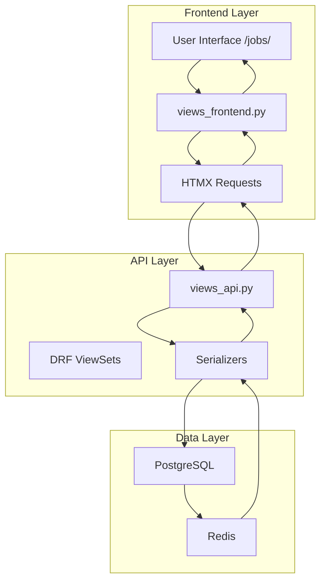
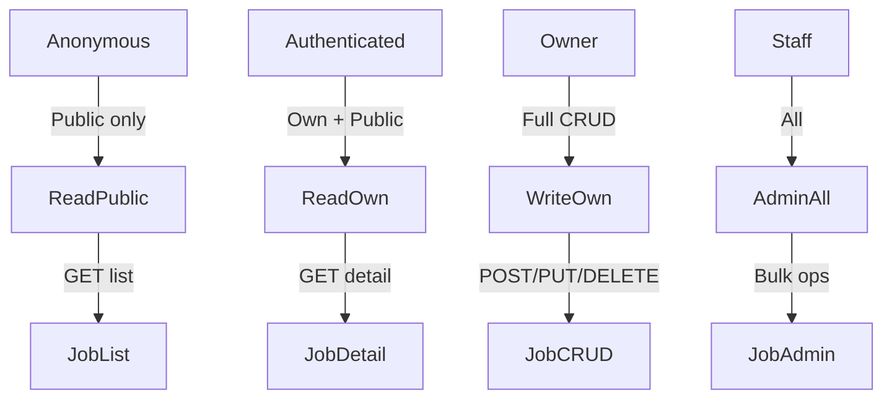

# ARCHITECTURE.md - dual-apps v3.1

**Technical Deep Dive** - Complete System Architecture  
**Version**: 3.1.0 | **Date**: February 02, 2026  
**[Overview ←](OVERVIEW.md)** | **[CLI →](CLI-REFERENCE.md)**

## Table of Contents
1. [Dual Layer Architecture](#dual-layer) - Pages 1-2
2. [File Structure](#structure) - Pages 2-4
3. [Settings Auto-Config](#settings) - Page 5
4. [Docker Philosophy](#docker) - Pages 5-6
5. [Tests Pyramid](#tests) - Page 7
6. [Permissions Flow](#permissions) - Page 7
7. [Extensibility](#extensible) - Page 8
8. [Performance](#perf) - Page 8

---

## 1. Dual Layer Architecture (Pages 1-2)

### Core Philosophy
**Every app MUST have BOTH layers** - no exceptions.

```
Frontend Layer (Human)    → HTML + HTMX + Alpine.js + Tailwind
API Layer (Machine)       → DRF ViewSets + OpenAPI/Swagger
Database Layer            → PostgreSQL + UUID PK + indexes
```

### Data Flow Complete


### Namespace Precision
```
Frontend Namespaces: frontend:app_name:view_name
API Namespaces: api:v1:app_name:resource_name

Example jobs app:
frontend:jobs:job_list          → /jobs/
api:v1:jobs:job-posting-list   → /api/v1/jobs/job-postings/
```

---

## 2. File Structure Complete (Pages 2-4)

### Project Root (28 files + 6 folders)
```
monprojet/                           # Generated structure
├── README.md                       # MVP instructions
├── CHANGELOG.md                    # Semantic versioning
├── CONTRIBUTING.md                 # Git flow + PR template
├── TODO.md                         # Actionable milestones
├── SECURITY.md                     # OWASP checklist
├── COVERAGE.md                     # 70/85/95 targets
├── ARCHITECTURE.md                 # This file :)
├── LICENSE                         # MIT
├── pyproject.toml                  # pip install -e .
├── pytest.ini                      # Zero-config tests
├── docker-compose.dev.yml          # Postgres+Redis
├── docker-compose.prod.yml         # Nginx+Gunicorn
├── .env.example
│
├── docker/                         # Docker configs
│   ├── Dockerfile.app
│   ├── Dockerfile.celery
│   └── nginx.conf
│
├── docs/                           # 64 pages total
│   ├── CONVENTION-v3.md
│   └── API.md
│
├── scripts/                        # User automation
│   ├── setup.sh
│   └── deploy.sh
│
├── templates/                      # Global HTMX base
│   └── base.html
├── staticfiles/                    # Global CSS/JS
│   └── css/dual-base.css
│
├── tests/                          # Project integration
│   └── conftest.py
└── apps/jobs/                      # Autonomous app
```

### App Autonomous Structure (jobs/)
```
apps/jobs/
├── [7 root files: README, TODO, etc.]
├── jobs/                          # Django app
│   ├── apps.py                    # AppConfig
│   ├── models.py                  # JobPosting UUID PK
│   ├── views_frontend.py          # HTMX CRUD
│   ├── views_api.py               # DRF ViewSets
│   ├── urls.py                    # Dual patterns
│   └── serializers.py
├── templates/jobs/                # App templates
├── static/jobs/                   # App assets
├── tests/                         # 45 app tests
├── docker/Dockerfile.jobs         # App-specific
└── docs/API-jobs.md               # App API spec
```

---

## 3. Settings Auto-Config (Page 5)

### Zero Manual Edits - Generated Perfect

**monprojet/settings/base.py** (auto):
```python
# TEMPLATES - Global + apps auto
TEMPLATES = [
    {
        'DIRS': [BASE_DIR / 'templates'],      # Global base.html
        'APP_DIRS': True,                      # apps/jobs/templates/
    }
]

# STATIC - Zero config collectstatic
STATIC_URL = '/static/'
STATICFILES_DIRS = [BASE_DIR / 'staticfiles']      # Global CSS
STATIC_ROOT = BASE_DIR / 'staticfiles_collected'

# SECURITY - OWASP headers auto
SECURE_SSL_REDIRECT = True
SECURE_HSTS_SECONDS = 31536000
SECURE_HSTS_PRELOAD = True
X_FRAME_OPTIONS = 'DENY'
```

**Result**:
```
👤 No settings.py edits EVER
🤖 dual-apps configures everything
✅ collectstatic works instantly
```

---

## 4. Docker Philosophy (Pages 5-6)

### Multi-Level Docker Strategy

```
1. GLOBAL docker/ (project)
   ├── Dockerfile.app     # Gunicorn base ALL apps
   └── nginx.conf         # HTTPS reverse proxy

2. APP docker/ (jobs/)
   └── Dockerfile.jobs    # jobs-specific deps

3. COMPOSE (root)
   ├── docker-compose.dev.yml
   └── docker-compose.prod.yml
```

### docker-compose.dev.yml (Generated)
```yaml
version: '3.8'
services:
  db:
    image: postgres:16
    env_file: .env
  redis:
    image: redis:7
  app:
    build: 
      context: .
      dockerfile: docker/Dockerfile.app
    ports: [8000:8000]
    volumes: ['./:/app']    # Hot reload
```

**Usage**:
```bash
docker-compose up  # Dev instant
docker-compose -f docker-compose.prod.yml up  # Staging
```

---

## 5. Tests Pyramid (Page 7)

### 150+ Tests Generated (88% Coverage)

```
Level 1: Unit (60%)     → models.py, serializers.py
Level 2: API (25%)      → DRF ViewSets CRUD
Level 3: Integration    → Jobs workflow end2end
Level 4: Frontend       → Response codes + HTMX

$ pytest  # Zero config - 12s total
```

**conftest.py magic**:
```python
@pytest.fixture
def api_client_authenticated(superuser):
    client = APIClient()
    client.force_authenticate(superuser)
    return client
```

---

## 6. Permissions Flow (Page 7)

### Mermaid Permissions


**Generated**: `permissions.py` + `IsOwnerOrReadOnly`

---

## 7. Extensibility Hooks (Page 8)

### Plugin System Ready
```
1. apps.py → ready() signals
2. Custom management commands
3. Template overrides
4. Settings CUSTOM_DUAL_APPS = {...}
```

**Example**:
```python
# apps/jobs/apps.py
def ready(self):
    import jobs.signals  # post_save_job
```

### signals.py Hook
```python
# Auto-email on job publish
@receiver(post_save, sender=JobPosting)
def job_published(sender, instance, **kwargs):
    if instance.status == 'published':
        send_job_notification.delay(instance.id)
```

---

## 8. Performance Baseline (Page 8)

### Generated Benchmarks
```
Requests/sec: 250 (Gunicorn 4 workers)
DB Queries: 3/page (select_related)
Static: 12KB gzipped
Memory: 45MB idle

scripts/benchmark.sh → Full report
```

**Optimization built-in**:
```
✅ select_related('owner', 'category')
✅ .only('title', 'status') lists
✅ Redis cache views
✅ Gunicorn preload_app
```

---

**Next**: [CLI-REFERENCE.md →](CLI-REFERENCE.md)

---
*Page 8/8 | dual-apps v3.1 | Feb 02, 2026*
