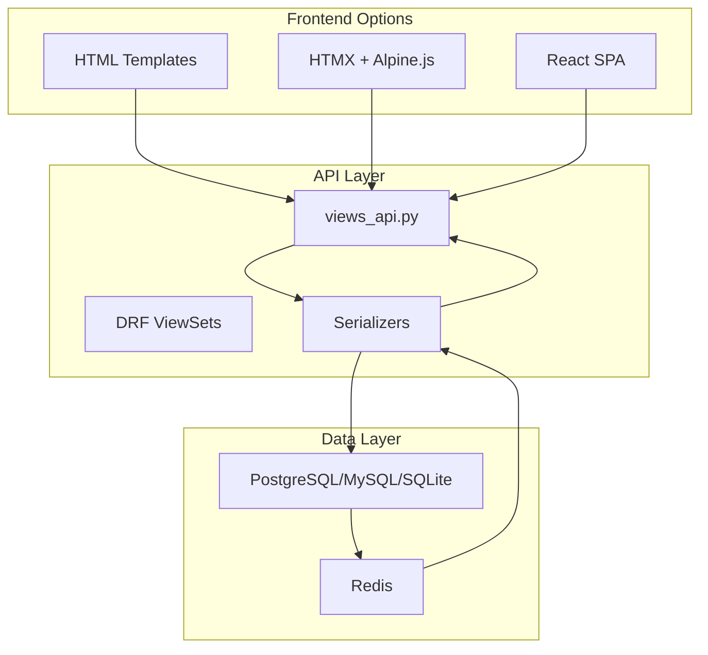

# ARCHITECTURE.md - dual-apps v4.0

**Technical Deep Dive** - Complete System Architecture
**Version**: 4.0.0 | **Date**: February 03, 2026
**[Overview ←](OVERVIEW.md)** | **[CLI →](CLI-REFERENCE.md)**

## Table of Contents
1. [Dual Layer Architecture](#dual-layer) - Pages 1-2
2. [Specialized Templates](#specialized) - Pages 2-3
3. [Frontend Architecture](#frontend) - Pages 3-4
4. [File Structure](#structure) - Pages 4-5
5. [Settings Auto-Config](#settings) - Page 5
6. [Docker Philosophy](#docker) - Page 6
7. [Tests Pyramid](#tests) - Page 6
8. [Security Architecture](#security) - Page 7
9. [Performance](#perf) - Page 8

---

## 1. Dual Layer Architecture (Pages 1-2)

### Core Philosophy
**Every app MUST have BOTH layers** - no exceptions.

```
Frontend Layer (Human)    → HTML / HTMX / React
API Layer (Machine)       → DRF ViewSets + OpenAPI/Swagger
Database Layer            → PostgreSQL / MySQL / SQLite + UUID PK + indexes
```

### Data Flow Complete


### Namespace Precision
```
Frontend Namespaces: frontend:app_name:view_name
API Namespaces: api:v1:app_name:resource_name

Example jobs app:
frontend:jobs:job_list          → /jobs/
api:v1:jobs:job-posting-list   → /api/v1/jobs/job-postings/
```

---

## 2. Specialized Templates (Pages 2-3)

### 6 Industry-Ready Templates

| Template | Description | Default Apps | Frontend Types |
|----------|-------------|--------------|----------------|
| `ecommerce` | Online store | shop, cart, orders | HTML, HTMX, React |
| `blog` | Content platform | blog, comments | HTML, HTMX, React |
| `saas` | SaaS application | subscriptions, billing | HTML, HTMX, React |
| `cms` | Content management | pages, media | HTML, HTMX, React |
| `booking` | Reservation system | services, appointments | HTML, HTMX, React |
| `marketplace` | Multi-vendor | listings, sellers | HTML, HTMX, React |

### Template Architecture
```
Each specialized template includes:
├── Backend models with business logic
├── API endpoints with DRF ViewSets
├── Frontend templates (HTML/HTMX/React)
├── Admin configurations
├── Test suites
└── Documentation
```

---

## 3. Frontend Architecture (Pages 3-4)

### Three Frontend Options

#### HTML (Basic)
```
templates/
├── base.html           # CSS framework loaded
├── components/
│   ├── navbar.html
│   └── footer.html
└── {app_name}/
    ├── list.html
    ├── detail.html
    └── form.html
```

#### HTMX (Dynamic)
```
templates/
├── base.html           # HTMX + Alpine.js loaded
├── auth/
│   ├── login.html
│   ├── register.html
│   └── password_reset.html
├── partials/
│   └── messages.html
└── {app_name}/
    ├── list.html
    ├── detail.html
    ├── form.html
    └── partials/
        ├── card.html
        └── table_row.html
```

#### React (SPA)
```
frontend/
├── package.json        # Vite + React
├── vite.config.js
├── index.html
└── src/
    ├── main.jsx
    ├── App.jsx
    ├── api/
    │   └── client.js   # JWT API client
    ├── components/
    │   └── {AppName}/
    ├── pages/
    │   ├── Login.jsx
    │   └── Dashboard.jsx
    └── hooks/
        └── useAuth.js
```

### CSS Framework Support
- **Bootstrap 5**: Responsive grid, components, utilities
- **Tailwind CSS**: Utility-first, customizable, JIT compiler

### JWT Storage Options
| Option | Storage | Security | Use Case |
|--------|---------|----------|----------|
| `httpOnly` | Cookie | High | Web apps (default) |
| `localStorage` | Browser | Medium | Mobile/PWA apps |

---

## 4. File Structure Complete (Pages 4-5)

### Project Root
```
monprojet/                           # Generated structure
├── README.md                       # MVP instructions
├── CHANGELOG.md                    # Semantic versioning
├── CONTRIBUTING.md                 # Git flow + PR template
├── TODO.md                         # Actionable milestones
├── SECURITY.md                     # OWASP checklist
├── LICENSE                         # MIT
├── pyproject.toml                  # pip install -e .
├── pytest.ini                      # Zero-config tests
├── docker-compose.yml              # Dev orchestration
├── docker-compose.prod.yml         # Prod orchestration
├── .env.example
│
├── docker/                         # Docker configs
│   ├── Dockerfile.app
│   ├── Dockerfile.celery
│   └── nginx.conf
│
├── docs/                           # Documentation
│   ├── API.md
│   └── DEPLOYMENT.md
│
├── scripts/                        # Automation
│   ├── setup.sh
│   └── deploy.sh
│
├── templates/                      # Global templates
│   └── base.html
├── static/                         # Global assets
│   └── css/
│
├── frontend/                       # React (if --frontend=react)
│   └── src/
│
├── e2e/                            # Playwright E2E tests
│   ├── playwright.config.js
│   └── tests/
│
├── tests/                          # Integration tests
│   └── conftest.py
│
└── apps/                           # Django apps
    ├── core/                       # Core with security
    │   └── security/
    └── {app_name}/                 # Generated apps
```

### App Structure
```
apps/jobs/
├── jobs/                          # Django app
│   ├── apps.py                    # AppConfig
│   ├── models.py                  # UUID PK models
│   ├── views_frontend.py          # HTMX CRUD
│   ├── views_api.py               # DRF ViewSets
│   ├── urls.py                    # Dual patterns
│   ├── serializers.py
│   ├── forms.py
│   ├── permissions.py
│   └── admin.py
├── templates/jobs/                # App templates
├── static/jobs/                   # App assets
├── tests/                         # App tests
└── migrations/
```

---

## 5. Settings Auto-Config (Page 5)

### Zero Manual Edits - Generated Perfect

**monprojet/settings/base.py** (auto):
```python
# TEMPLATES - Global + apps auto
TEMPLATES = [
    {
        'DIRS': [BASE_DIR / 'templates'],      # Global base.html
        'APP_DIRS': True,                      # apps/jobs/templates/
    }
]

# STATIC - Zero config collectstatic
STATIC_URL = '/static/'
STATICFILES_DIRS = [BASE_DIR / 'static']      # Global CSS
STATIC_ROOT = BASE_DIR / 'staticfiles_collected'

# SECURITY - OWASP headers auto
SECURE_SSL_REDIRECT = True
SECURE_HSTS_SECONDS = 31536000
SECURE_HSTS_PRELOAD = True
X_FRAME_OPTIONS = 'DENY'
```

---

## 6. Docker Philosophy (Page 6)

### Multi-Level Docker Strategy

```
1. GLOBAL docker/ (project)
   ├── Dockerfile.app     # Gunicorn base ALL apps
   └── nginx.conf         # HTTPS reverse proxy

2. COMPOSE (root)
   ├── docker-compose.yml      # Development
   └── docker-compose.prod.yml # Production
```

### docker-compose.yml (Generated)
```yaml
version: '3.8'
services:
  db:
    image: postgres:16
    env_file: .env
  redis:
    image: redis:7
  app:
    build:
      context: .
      dockerfile: docker/Dockerfile.app
    ports: [8000:8000]
    volumes: ['./:/app']    # Hot reload
```

---

## 7. Tests Pyramid (Page 6)

### 392+ Tests Generated (97% Coverage)

```
Level 1: Unit (70%)     → models.py, serializers.py
Level 2: API (20%)      → DRF ViewSets CRUD
Level 3: Integration    → Workflow end-to-end
Level 4: E2E (5%)       → Playwright browser tests

$ pytest  # Zero config - passes immediately
```

### E2E Test Structure
```
e2e/
├── playwright.config.js
├── package.json
├── fixtures/
│   └── auth.js
└── tests/
    ├── auth.spec.js
    ├── ecommerce.spec.js
    ├── saas.spec.js
    ├── booking.spec.js
    └── marketplace.spec.js
```

---

## 8. Security Architecture (Page 7)

### Core Security Module
```
apps/core/security/
├── __init__.py
├── validators.py       # Input validation
├── middleware.py       # Security headers
├── throttling.py       # Rate limiting
├── mixins.py           # View mixins
└── decorators.py       # Security decorators
```

### OWASP Headers (Auto-configured)
```python
SECURE_CONTENT_TYPE_NOSNIFF = True
X_FRAME_OPTIONS = "DENY"
SECURE_HSTS_SECONDS = 31536000
SECURE_HSTS_PRELOAD = True
SECURE_SSL_REDIRECT = True
CSRF_COOKIE_SECURE = True
SESSION_COOKIE_SECURE = True
```

### Rate Limiting
```python
REST_FRAMEWORK = {
    'DEFAULT_THROTTLE_CLASSES': [
        'rest_framework.throttling.AnonRateThrottle',
        'rest_framework.throttling.UserRateThrottle'
    ],
    'DEFAULT_THROTTLE_RATES': {
        'anon': '100/hour',
        'user': '1000/hour'
    }
}
```

### JWT Security
- Access token expiration: 15 minutes
- Refresh token expiration: 7 days
- httpOnly cookie storage (default)
- Token refresh handling in React

---

## 9. Performance Baseline (Page 8)

### Generated Benchmarks
```
Requests/sec: 250 (Gunicorn 4 workers)
DB Queries: 3/page (select_related)
Static: 12KB gzipped
Memory: 45MB idle

scripts/benchmark.sh → Full report
```

**Optimization built-in**:
```
✅ select_related('owner', 'category')
✅ .only('title', 'status') lists
✅ Redis cache views
✅ Gunicorn preload_app
✅ WhiteNoise static serving
```

---

**Next**: [CLI-REFERENCE.md →](CLI-REFERENCE.md)

---
*Page 8/8 | dual-apps v4.0 | Feb 03, 2026*
