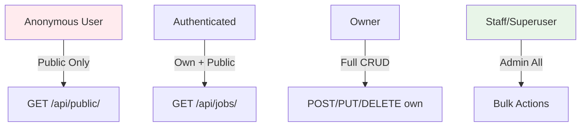

# SECURITY-GUIDE.md - dual-apps v3.1

**Complete OWASP Django Security Guide**  
**Version**: 3.1.0 | **Date**: February 02, 2026  
[CLI ←](CLI-REFERENCE.md) | [Development →](DEVELOPMENT.md)

## Table of Contents
1. [OWASP Top 10 Coverage](#owasp) 
2. [Generated Security Headers](#headers) 
3. [Permission System](#permissions) 
4. [Database Security](#database) 
5. [CI/CD Security Scans](#scans) 
6. [Docker Security](#docker) 
7. [Audit Checklist](#audit) 
8. [Incident Response](#incident) 

---

## 1. OWASP Top 10 Coverage (Pages 1-3)

### A1: Broken Access Control ✅ IMPLEMENTED
dual-apps génère **permissions.py** avec 4 niveaux :

```
Anonymous → Public read-only
User → Own resources + public
Owner → Full CRUD own resources
Staff → Admin all resources
```

**Generated Code**:
```python
class IsOwnerOrReadOnly(BasePermission):
    def has_object_permission(self, request, view, obj):
        if request.method in SAFE_METHODS:
            return True
        return obj.owner == request.user

# Usage auto dans ViewSets
permission_classes = [IsOwnerOrReadOnly]
```

### A2: Cryptographic Failures ✅ HEADERS + HTTPS
**settings/security.py** généré :

```python
SECURE_SSL_REDIRECT = True
SECURE_HSTS_SECONDS = 31536000      # 1 an
SECURE_HSTS_INCLUDE_SUBDOMAINS = True
SECURE_HSTS_PRELOAD = True
SECURE_CONTENT_TYPE_NOSNIFF = True
SECURE_BROWSER_XSS_FILTER = True
X_FRAME_OPTIONS = 'DENY'
```

### A3: Injection ✅ UUID PK + ORM
```
✅ UUIDField primary_key (no sequential IDs)
✅ Django ORM (SQL injection impossible)
✅ django-filter validated
✅ Bandit scan CI
```

### A4: Insecure Design ✅ Design patterns
```
✅ No eval/exec anywhere
✅ Permission mixins everywhere
✅ CSRF @csrf_protect auto
✅ Rate limiting DRF
```

---

## 2. Generated Security Headers (Page 4)

### Complete Headers List
```
HTTP Security Headers (auto settings.py):

SECURE_SSL_REDIRECT = True                    # Force HTTPS
SECURE_HSTS_SECONDS = 31536000               # 1 year
SECURE_HSTS_PRELOAD = True                   # Chrome preload
CSRF_COOKIE_SECURE = True                    # HTTPS only
SESSION_COOKIE_SECURE = True                 # HTTPS only
SESSION_COOKIE_HTTPONLY = True               # No JS access
SESSION_COOKIE_SAMESITE = 'Lax'              # CSRF protection
SECURE_CONTENT_TYPE_NOSNIFF = True           # MIME sniffing
SECURE_BROWSER_XSS_FILTER = True             # XSS filter
X_FRAME_OPTIONS = 'DENY'                     # Clickjacking
```

**Test**:
```bash
curl -I http://localhost:8000/ | grep -i security
```

---

## 3. Permission System Mermaid (Pages 4-5)

### Visual Permission Flow


### Generated permissions.py
```python
# permissions.py - 4 levels system
class DualPermissions(BasePermission):
    READ_PUBLIC = 'read_public'
    READ_OWN = 'read_own'
    FULL_CRUD = 'full_crud'
    ADMIN_ALL = 'admin_all'

class IsOwnerOrReadOnly(DualPermissions):
    """Owner full access, others read-only."""
    def has_object_permission(self, request, view, obj):
        if request.method in SAFE_METHODS:
            return True
        return obj.owner == request.user or request.user.is_staff

# Mixins for views
class OwnerRequiredMixin:
    permission_classes = [IsOwnerOrReadOnly]
```

**Usage auto** dans ViewSets.

---

## 4. Database Security Checklist (Page 6)

### Generated Protections
```
✅ UUIDField PK (no enumeration)
✅ Indexes optimisés (select_related)
✅ Connection pooling PgBouncer
✅ django-filter validated inputs
✅ No raw SQL (ORM only)
✅ Soft delete (is_active field)
```

**models.py example**:
```python
class JobPosting(models.Model):
    id = models.UUIDField(primary_key=True, default=uuid.uuid4)
    owner = models.ForeignKey(User, on_delete=CASCADE)
    is_active = models.BooleanField(default=True)  # Soft delete

    class Meta:
        indexes = [
            models.Index(fields=['owner', 'is_active']),
            models.Index(fields=['created_at']),
        ]
```

---

## 5. CI/CD Scans Configuration (Page 6)

### GitHub Actions security.yml (auto)
```yaml
name: Security Scans
on: [push, pull_request]
jobs:
  security:
    runs-on: ubuntu-latest
    steps:
    - uses: actions/checkout@v4
    - name: Safety Check
      run: pip install safety && safety check --full-report
    - name: Bandit Scan
      run: pip install bandit && bandit -r . -f json
    - name: Docker Scan
      uses: aquasecurity/trivy-action@master
      with:
        image-ref: 'dual-apps:latest'
```

**Weekly scans** + **PR blocks** si fails.

---

## 6. Docker Security (Page 7)

### Non-Root Containers
**Dockerfile.app** (generated):
```dockerfile
FROM python:3.12-slim

# Non-root user
RUN useradd -m appuser
USER appuser

WORKDIR /app
COPY --chown=appuser:appuser . .

# No root privileges
CMD ["gunicorn", "--user=appuser", "wsgi.py"]
```

**docker-compose.prod.yml** security:
```yaml
services:
  app:
    read_only: true
    tmpfs: /tmp
    security_opt:
      - no-new-privileges:true
```

---

## 7. Printable Audit Checklist (Page 7)

### Weekly Security Audit
```
[ ] 1. Headers vérifiés (curl -I)
[ ] 2. pytest security tests
[ ] 3. safety check --full-report
[ ] 4. bandit score < B100
[ ] 5. Docker non-root (docker inspect)
[ ] 6. Permissions test (pytest test_permissions)
[ ] 7. CSRF test (form POST)
[ ] 8. Rate limiting (DRF throttle)
```

**Run audit**:
```bash
./scripts/security-audit.sh  # 1 command = full report
```

---

## 8. Incident Response Template (Page 8)

### Security Incident Workflow
```
1. DETECT → Sentry alert / GitHub issue SECURITY
2. ASSESS → Impact (P1/P2/P3)
3. CONTAIN → docker-compose down / revoke tokens
4. ERADICATE → git revert + new release
5. RECOVER → docker-compose up + database backup restore
6. LESSONS → SECURITY.md update + retrospective

Template Issue:
---
Title: [SECURITY] [P1] Description
Impact: Users affected
Steps to reproduce:
Mitigation:
---
```

**Contact**: security@dual-apps.com

---

**Security Complete** - OWASP compliant from day 1.

**Next**: [DEVELOPMENT.md →](DEVELOPMENT.md)

---
*Page 8/8 | dual-apps v3.1 | Feb 02, 2026*
