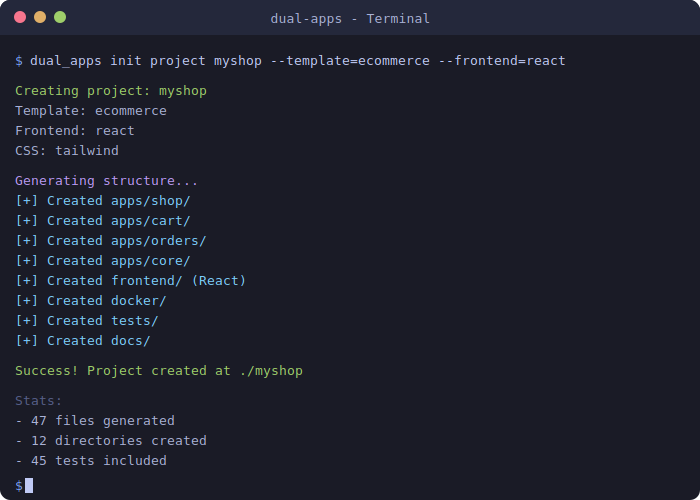

# Quick Start Guide

Get a production-ready Django project running in 5 minutes.



## 1. Install dual-apps

```bash
pip install dual-apps
```

## 2. Generate a Project

### Option A: Simple Command

```bash
# Basic project
dual_apps init project myproject --apps=jobs,users

# Ecommerce store with React and Tailwind
dual_apps init project myshop --template=ecommerce --frontend=react --css=tailwind

# SaaS application with HTMX and Bootstrap
dual_apps init project mysaas --template=saas --frontend=htmx --css=bootstrap

# Blog with basic HTML
dual_apps init project myblog --template=blog --frontend=html
```

### Option B: Interactive Mode

```bash
dual_apps init project --interactive
```

This will ask you:
- Project name
- Template type (default, ecommerce, blog, saas, cms, booking, marketplace)
- Apps to create
- Frontend (html, htmx, react)
- CSS framework (bootstrap, tailwind)
- Database (PostgreSQL/MySQL/SQLite)
- Authentication (JWT/Session/allauth)
- JWT storage (httpOnly/localStorage)
- Docker support
- Celery support
- Internationalization

### Option C: Config File

```bash
# Generate config template
dual_apps config --output=dual-apps.yaml

# Edit the config file, then generate:
dual_apps init project myproject --config=dual-apps.yaml
```

## 3. Start the Project

```bash
cd myproject

# Quick start with Docker
docker-compose up -d

# Or manual setup
python -m venv .venv
source .venv/bin/activate  # On Windows: .venv\Scripts\activate
pip install -r requirements/dev.in
cp .env.example .env
python manage.py migrate
python manage.py createsuperuser
python manage.py runserver
```

## 4. Access Your Application

- **Frontend**: http://localhost:8000/
- **API**: http://localhost:8000/api/v1/
- **Admin**: http://localhost:8000/admin/
- **API Docs**: http://localhost:8000/api/docs/

## 5. Run Tests

```bash
pytest
# Expected: 150+ tests, 97% coverage
```

## Project Structure

```
myproject/
├── myproject/           # Django settings
│   ├── settings/
│   │   ├── base.py
│   │   ├── dev.py
│   │   ├── prod.py
│   │   └── security.py
│   ├── urls.py
│   └── wsgi.py
├── apps/
│   ├── core/            # Core app with security
│   │   └── security/    # Security module
│   ├── jobs/            # Generated app
│   └── users/           # Generated app
├── templates/           # Global templates
├── static/              # Static files
├── frontend/            # React frontend (if --frontend=react)
├── tests/               # Integration tests
├── e2e/                 # Playwright E2E tests
├── docker/              # Docker configs
├── scripts/             # Utility scripts
├── docs/                # Documentation
└── requirements/        # Dependencies
```

## Specialized Template Structures

### Ecommerce (`--template=ecommerce`)

```
myshop/
├── apps/
│   ├── shop/            # Products, categories
│   ├── cart/            # Shopping cart
│   └── orders/          # Order management
├── templates/
│   └── ecommerce/       # Store templates
└── frontend/            # React components (if react)
```

### SaaS (`--template=saas`)

```
mysaas/
├── apps/
│   ├── subscriptions/   # Plans, pricing
│   ├── billing/         # Invoices, payments
│   └── tenants/         # Multi-tenancy
├── templates/
│   └── saas/            # SaaS templates
└── frontend/
    └── components/
        └── PricingPage.jsx
```

### Blog (`--template=blog`)

```
myblog/
├── apps/
│   ├── blog/            # Posts, categories
│   └── comments/        # Comment system
├── templates/
│   └── blog/            # Blog templates
└── frontend/            # React components (if react)
```

## Adding More Apps

```bash
dual_apps add app products --to=myproject
```

## Frontend Options

### HTML (Basic)

```bash
dual_apps init project myproject --frontend=html --css=bootstrap
```

Simple server-rendered templates, no JavaScript required.

### HTMX (Recommended)

```bash
dual_apps init project myproject --frontend=htmx --css=tailwind
```

Dynamic updates without full page reloads, full authentication flow.

### React (SPA)

```bash
dual_apps init project myproject --frontend=react --css=tailwind
```

Full single-page application with JWT authentication.

```bash
# Start the React frontend
cd myproject/frontend
npm install
npm run dev
```

## JWT Storage Options

### httpOnly Cookies (Recommended)

```bash
dual_apps init project myproject --auth=jwt --jwt-storage=httpOnly
```

More secure, tokens stored in httpOnly cookies.

### localStorage

```bash
dual_apps init project myproject --auth=jwt --jwt-storage=localStorage
```

Tokens stored in browser localStorage (for specific use cases).

## Next Steps

- Read the [CLI Reference](cli-reference.md) for all commands
- Check [Architecture](architecture.md) for how it works
- See [Security](security.md) for security features
- Explore [Templates](templates.md) for customization options
